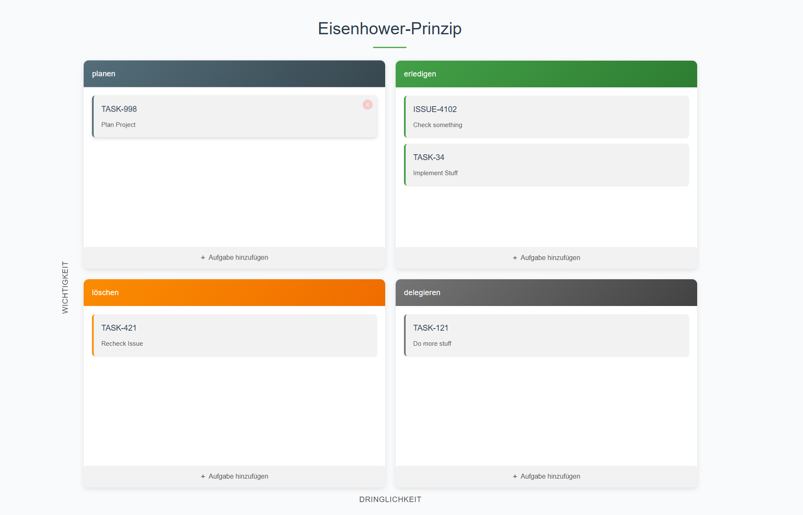

# Eisenhower Matrix Task Planner

[howermatrix.netlify.app](https://howermatrix.netlify.app/)

[](https://app.netlify.com/sites/howermatrix/deploys)

[](LICENCE) 

## 📋 Overview

[Howermatrix](https://howermatrix.netlify.app/) is an elegant, browser-based implementation of the Eisenhower Matrix - a powerful time management tool that helps you prioritize tasks based on their importance and urgency.



## ✨ Features

- **Intuitive Interface**: Clean, modern design with smooth animations
- **Drag & Drop**: Easily move tasks between quadrants as priorities change
- **Persistent Storage**: Tasks automatically saved to your browser's local storage
- **Responsive Design**: Works seamlessly on desktop and mobile devices
- **Offline Support**: No internet connection required after initial load

## 🚀 The Eisenhower Principle

The matrix divides tasks into four quadrants:

1. **Important & Urgent**: Tasks that need immediate attention
2. **Important & Not Urgent**: Tasks to schedule and complete personally
3. **Not Important & Urgent**: Tasks to delegate when possible
4. **Not Important & Not Urgent**: Tasks to minimize or eliminate

## 💻 Usage

1. Visit [howermatrix.netlify.app](https://howermatrix.netlify.app/)
2. Add tasks to the appropriate quadrant
3. Double-click tasks to edit
4. Drag tasks between quadrants to reprioritize
5. Return anytime to see your task matrix - all data is saved locally

## 🔧 Development

This application is built with pure HTML, CSS, and JavaScript - no frameworks or dependencies required.

```bash
# Clone the repository
git clone https://github.com/yourusername/howermatrix.git

# Open index.html in your browser
open index.html
```

## 📱 Privacy

All task data is stored locally in your browser using localStorage. No data is sent to any server.

## 📄 License

This project is licensed under the MIT License - see the LICENSE file for details.

## 🔗 Links

- [Live Demo](https://howermatrix.netlify.app/)
- [Learn more about the Eisenhower Principle](https://en.wikipedia.org/wiki/Time_management#The_Eisenhower_Method)

---

Made with ❤️ by Luke